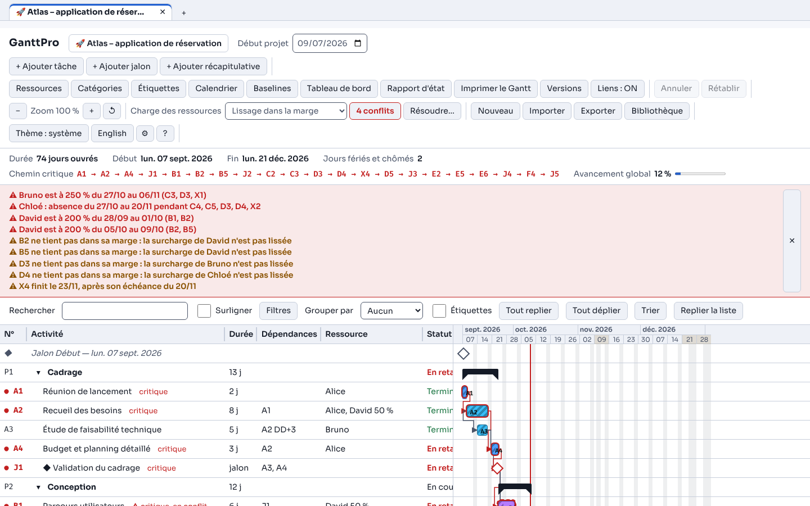
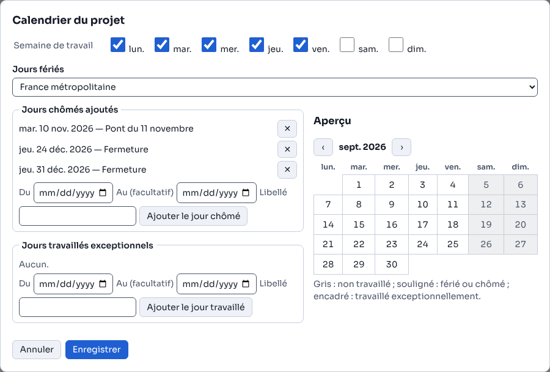
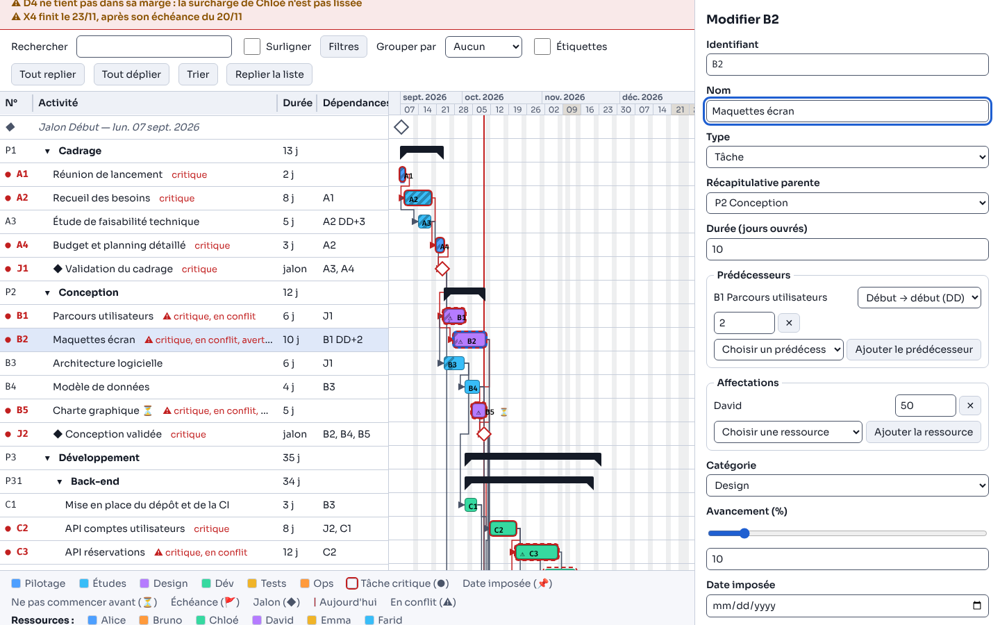
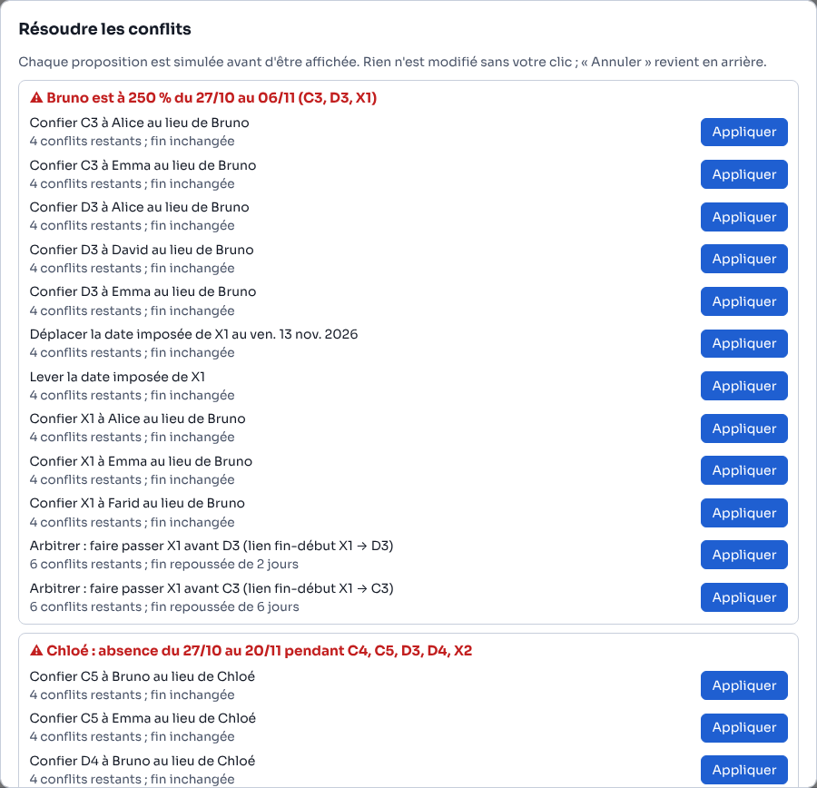
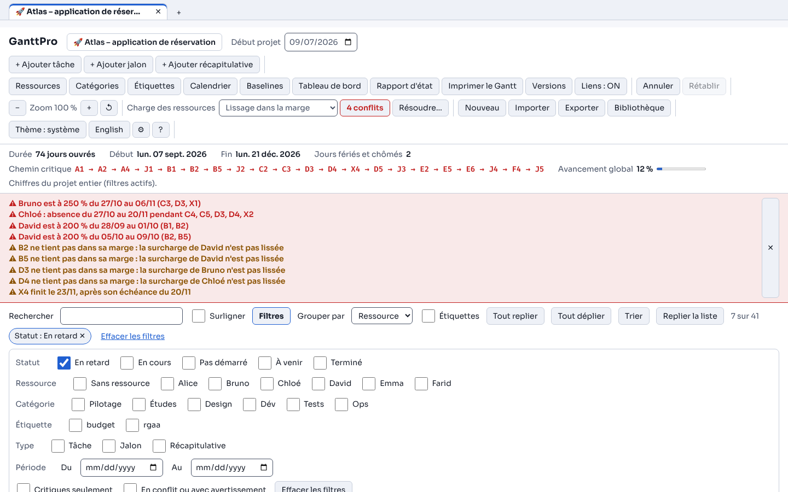
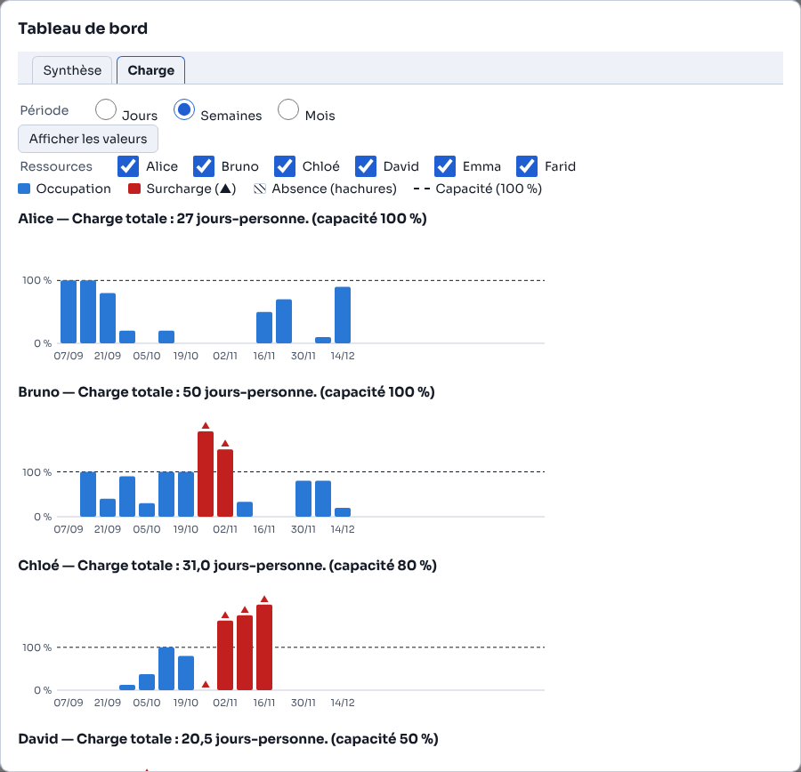
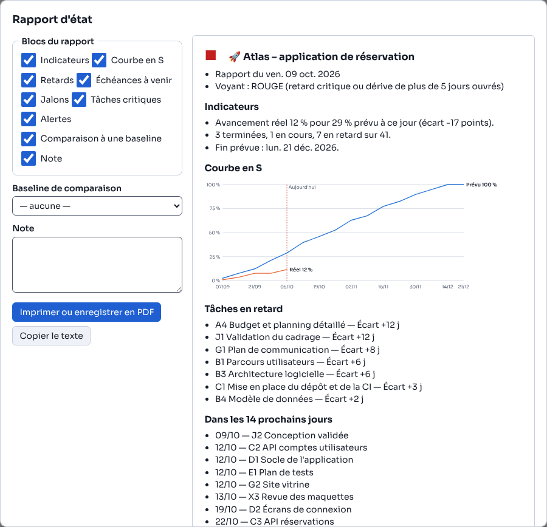

# GanttPro 3 – Guide utilisateur

Version 3 — 9 octobre 2026

## 1. Prise en main

GanttPro planifie un projet en jours ouvrés, calcule les dates, le chemin critique et la charge des ressources, puis suit l'avancement. Tout tient dans un seul fichier, GanttPro.html, qui s'ouvre d'un double-clic dans Chrome, Edge, Firefox ou Safari, sans installation, sans compte et sans connexion.

**Premier lancement.** L'application ouvre un projet minimal : « Nouveau projet », début à la date du jour, une tâche A de 10 jours « Renommer cette tâche… », une ressource « Ressource » et une catégorie « Général ». Rien n'est enregistré sur l'appareil tant que vous ne le demandez pas : pensez à exporter (section 12) ou à enregistrer dans la bibliothèque (section 13).

**Les zones de l'écran, de haut en bas :**

| Zone | Ce qu'elle contient |
| --- | --- |
| Onglets de projets | Un onglet par projet ouvert (dix au plus), un point ● s'il a des modifications non enregistrées, « + » pour en ouvrir un autre |
| Barre du haut | Nom du projet, « Début projet », et toutes les commandes : ajout, fenêtres de gestion, annuler, zoom, gestion de la charge, fichiers, thème, langue, réglages, aide |
| Barre de chiffres | Durée, début, fin, jours fériés et chômés, chemin critique, avancement global |
| Bandeau d'alertes | Conflits de ressources et avertissements de dates ; se masque par ✕ et se rouvre par le badge « n conflits » |
| Barre de recherche | Recherche, filtres, « Grouper par », étiquettes, tout replier ou déplier, trier, replier la liste |
| Liste des tâches et grille de Gantt | Une ligne par tâche à gauche, sa barre à droite ; les deux défilent ensemble |
| Légende | Catégories, symboles, ressources et statuts |
| Édition | Panneau à droite qui s'ouvre quand on choisit une tâche |

Toutes les fenêtres (ressources, calendrier, tableau de bord…) se ferment par Échap ou par leur bouton, et rendent le focus au bouton qui les a ouvertes. Une modification de données s'annule par « Annuler » ou Ctrl + Z, jusqu'à 50 pas en arrière.

## 2. Créer et régler le projet

Un projet se définit par son nom, sa date de début et son calendrier ; tout le planning se recalcule dès que l'un d'eux change.

1. **Nom, description, emoji** : cliquez sur l'étiquette du projet dans la barre du haut. Le nom est obligatoire (60 caractères au plus), la description facultative (500 caractères), l'emoji se choisit parmi 20 propositions, au clavier comme à la souris.
2. **Début du projet** : champ « Début projet ». Un samedi ou un jour férié est accepté ; les tâches commencent alors au premier jour ouvré suivant, et la date saisie reste affichée.
3. **Calendrier** : bouton « Calendrier ». Vous y réglez :
   - la semaine de travail (cases du lundi au dimanche, au moins un jour coché) ;
   - le jeu de jours fériés : France métropolitaine (défaut), France Alsace-Moselle (plus le Vendredi saint et le 26 décembre), Belgique, Allemagne (jours nationaux) ou Aucun ;
   - les jours chômés ajoutés (pont, fermeture, férié d'un autre pays) et les jours travaillés exceptionnels, en date seule ou en plage, avec un libellé.

L'aperçu mensuel de la fenêtre grise les jours non travaillés et nomme les jours fériés ; rien n'est appliqué avant « Enregistrer ». Une même date ne peut pas être à la fois chômée et travaillée. Un jour travaillé exceptionnel l'emporte sur tout : un samedi déclaré travaillé compte dans les durées.

**Toutes les durées se comptent en jours ouvrés** : une tâche de 5 jours qui commence un lundi finit le vendredi ; si un jour férié tombe dans la semaine, elle finit le lundi suivant.

## 3. Tâches, jalons et récapitulatives

Le planning se construit avec trois types d'éléments : la **tâche** (un travail qui dure de 1 à 3 650 jours ouvrés), le **jalon** (un événement de durée nulle, affiché en losange ◆) et la **récapitulative** (un groupe de tâches dont les dates et l'avancement se calculent).

### Ajouter

« + Ajouter tâche », « + Ajouter jalon » ou « + Ajouter récapitulative » crée l'élément aussitôt et ouvre son édition, le nom prêt à être saisi. L'identifiant est proposé dans la suite A, B… Z, AA, AB. Si une récapitulative est sélectionnée, l'élément s'y range. « Annuler » (Ctrl + Z) retire un ajout fait par erreur.

### Modifier

Un clic sur le nom d'une ligne, sur sa barre ou son jalon (ou Entrée au clavier) ouvre le panneau d'édition. Rien n'est appliqué avant **Enregistrer** ; **Annuler** ou Échap ferme sans rien changer. Si un champ est refusé, rien n'est enregistré : le message s'affiche sous le champ (par exemple « Durée (jours ouvrés) : entier de 1 à 3 650. ») et le curseur y va.

| Champ | Ce qu'il faut savoir |
| --- | --- |
| Identifiant | 1 à 12 caractères A-Z, 0-9, point, tiret, tiret bas, unique. Le renommer met à jour les liens des autres tâches et les baselines. |
| Nom | Obligatoire, 200 caractères au plus |
| Type | Tâche ou jalon (une récapitulative reste récapitulative) |
| Récapitulative parente | Range la tâche dans un groupe (5 niveaux au plus) |
| Durée | En jours ouvrés, tâches seulement |
| Prédécesseurs | Liens vers d'autres tâches, avec type et délai (section 4) |
| Affectations | Ressources et taux d'occupation (section 5) |
| Catégorie | Donne sa couleur à la barre |
| Avancement | Curseur et champ liés, de 0 à 100 % ; case « Atteint » pour un jalon |
| Date imposée, Ne pas commencer avant, Échéance | Contraintes de dates (section 4) |
| Début réel, fin réelle | Suivi (section 9) |
| Étiquettes | Mots-clés séparés par des virgules (10 par tâche), avec suggestions tirées du projet |
| Notes, commentaires | Notes libres (2 000 caractères) et journal de commentaires datés ; une icône 📝 les signale sur la ligne |

### Hiérarchie

- **Mettre en retrait** (bouton de l'édition, Ctrl + Maj + →) : la tâche devient enfant de la récapitulative située juste au-dessus. **Remonter d'un niveau** (Ctrl + Maj + ←) fait l'inverse.
- **Regrouper sous une récapitulative** (barre de sélection) crée un groupe au-dessus de plusieurs tâches du même niveau.
- Le chevron ▾ / ▸ replie ou déplie un groupe ; « Tout replier » et « Tout déplier » agissent sur tous. Un groupe replié garde ses dates et son avancement.
- Une récapitulative n'a ni durée saisie, ni lien, ni ressource : son édition affiche ses valeurs « calculées ».

### Réordonner, trier, dupliquer, supprimer

- **Monter / Descendre** dans l'édition, ou glisser-déposer une ligne de la liste. Une récapitulative se déplace avec tout son contenu. L'ordre compte : à charge égale, la tâche la plus haute passe en premier.
- **Trier** (barre de recherche) range la liste pour que chaque prédécesseur soit avant ses successeurs, après une confirmation qui rappelle cet effet sur la priorité.
- **Dupliquer** (Ctrl + D) place une copie « (copie) » juste dessous, sans avancement, dates réelles ni commentaires ; une récapitulative est copiée avec tout son contenu.
- **Supprimer** (bouton ou Suppr) demande une confirmation qui nomme la tâche et compte les tâches qui perdront un prédécesseur. Pour une récapitulative, vous choisissez de supprimer aussi ses tâches ou de les conserver.

Les lignes « Jalon Début » et « Jalon Fin », en tête et en pied de liste, sont automatiques : elles montrent le début du projet et la fin du planning.

## 4. Liens et contraintes de dates

Les dates ne se saisissent pas : GanttPro les calcule à partir des liens, des contraintes et des ressources. Une tâche sans lien commence au début du projet.

### Les liens

Dans l'édition, choisissez un prédécesseur dans la liste puis « Ajouter le prédécesseur ». Chaque lien a un type et un délai en jours ouvrés, de −365 à +365 (positif pour attendre, négatif pour chevaucher). Exemples avec A du lundi 5 au vendredi 9 janvier 2026 :

| Type | Effet | B (3 j) lié à A |
| --- | --- | --- |
| Fin → début (FD) | B commence après la fin de A (cas le plus courant) | du 12 au 14/01 ; avec +2 : du 14 au 16/01 ; avec −1 : dès le 09/01 |
| Début → début (DD) | B commence au plus tôt avec A | du 05 au 07/01 ; avec +2 : du 07 au 09/01 |
| Fin → fin (FF) | B finit au plus tôt avec A | du 07 au 09/01 |
| Début → fin (DF) | B finit au plus tôt la veille ouvrée du début de A | utile pour un approvisionnement « juste à temps » |

La colonne « Dépendances » écrit les liens « A » (FD sans délai), « C DD+2 » ou « D FF−1 ». Un lien qui créerait une boucle est refusé avec le chemin, par exemple « Cette dépendance créerait la boucle A → B → A ». Une récapitulative ne se lie pas : liez ses tâches.

Un jalon lié en FD se place le jour même de la fin de son prédécesseur ; la tâche qui suit un jalon commence le jour ouvré suivant.

### Les contraintes

| Contrainte | Symbole | Effet |
| --- | --- | --- |
| Date imposée | 📌 | La tâche commence ce jour-là (ou le jour ouvré suivant), quoi que disent ses liens et ses ressources. Si elle contredit un lien, la ligne porte ⚠ et le bandeau l'explique : « B commence le 06/01 avant la fin de A (09/01) ». |
| Ne pas commencer avant | ⏳ | La tâche ne commence pas avant cette date ; sans effet si le calcul donne déjà plus tard. |
| Échéance | 🚩 | Ne déplace jamais la tâche. Si la fin la dépasse, le drapeau passe au rouge, la ligne indique « échéance dépassée », le bandeau donne les dates et la tâche devient critique. |

Au clavier, Alt + → et Alt + ← déplacent la date imposée de la tâche sélectionnée d'un jour ouvré ; à la souris, glissez sa barre (section 6).

## 5. Ressources et charge

Une ressource (personne ou équipe) travaille dans la limite de sa capacité ; GanttPro repère chaque jour où elle est surchargée ou absente, et vous laisse arbitrer.

### Gérer les ressources

Bouton **Ressources** : ajouter, renommer, changer le rôle, la capacité (1 à 100 %) et la couleur (10 teintes), supprimer. Un nom déjà pris, majuscules comprises, est refusé. Renommer ne casse aucune affectation. Supprimer une ressource utilisée demande une confirmation qui dit combien de tâches deviendront « sans ressource ».

Le bouton **Fiche** d'une ressource montre son avatar, ses tâches avec leurs dates, sa charge totale en jours-personne, sa capacité et ses **absences** (date de début, date de fin facultative, libellé), triées par date. Une capacité inférieure à un taux déjà affecté est refusée avec le nom de la tâche en cause.

Les noms de ressources peuvent être des données personnelles : préférez des prénoms, des initiales ou des fonctions.

### Affecter

Dans l'édition d'une tâche, rubrique **Affectations** : choisissez une ressource, « Ajouter la ressource », puis réglez son taux (1 à 100 %, jamais plus que sa capacité). Une tâche peut avoir jusqu'à 10 ressources. Deux tâches à 50 % chacune peuvent se dérouler en même temps pour la même personne.

### Choisir la gestion de la charge

La liste **Charge des ressources** de la barre du haut propose trois modes. Le choix est enregistré avec le projet et s'annule comme une modification.

| Mode | Ce que fait GanttPro | Quand le choisir |
| --- | --- | --- |
| Lissage dans la marge (défaut) | Décale une tâche surchargée seulement dans sa marge : la fin du projet ne bouge pas d'elle-même. Une surcharge qui ne tient pas dans la marge reste un conflit, signalé « B ne tient pas dans sa marge ». | Vous voulez garder la date de fin et arbitrer vous-même. |
| Nivellement automatique | Décale les tâches jusqu'à ce qu'aucune ressource ne soit surchargée, dans l'ordre de la liste, quitte à repousser la fin. | Vous voulez un planning réaliste sans conflit. |
| Sans nivellement | Ne déplace rien : chaque chevauchement au-delà de la capacité est un conflit. | Vous voulez voir les besoins bruts. |

Une tâche décalée l'indique sur sa ligne, par exemple « 3 j de décalage (Alice : surcharge) », et son édition précise quand elle commencerait sans ce décalage. Les tâches à date imposée, les jalons et les tâches sans ressource ne sont jamais décalés.

### Conflits et résolution

Un conflit est une période où une ressource dépasse sa capacité (« Alice est à 200 % du 07/01 au 09/01 (A, B) ») ou travaille pendant une absence (« Alice : absence du 12/01 au 13/01 pendant C »). Les lignes et les barres concernées portent ⚠ et « en conflit » ; le badge « n conflits » apparaît dans la barre du haut.

**Résoudre…** ouvre une fenêtre qui propose, pour chaque conflit, des corrections déjà simulées, des plus efficaces aux plus coûteuses, avec leur effet : conflits restants et décalage de la fin du projet.

- déplacer la date imposée en cause au premier jour où les ressources sont libres, ou la lever ;
- confier la tâche à une autre ressource libre sur toute sa période ;
- arbitrer : « faire passer A avant B », ce qui ajoute à B un lien fin-début A → B, visible et retirable ;
- pour tout le projet : passer en nivellement automatique.

Rien ne change avant votre clic sur **Appliquer** ; chaque correction s'annule par « Annuler ».

## 6. La grille de Gantt

Chaque tâche y est une barre placée sur un axe de jours calendaires ; on peut la déplacer, l'allonger et la lier directement à la souris ou au doigt.

### Lire la grille

| Élément | Signification |
| --- | --- |
| Barre colorée | Tâche, dans la couleur de sa catégorie ; la partie rayée montre l'avancement |
| Barre rouge avec halo, ● sur la ligne | Tâche critique : tout retard repousse la fin du projet |
| Contour pointillé et ⚠ | Tâche en conflit de ressource |
| Crochet noir | Récapitulative |
| Losange ◆ plein ou creux | Jalon atteint ou non |
| Fine bande sous la barre | Dates réelles, dans la couleur de la première ressource |
| Très fines barres en dessous | Baselines affichées (section 10) ; leur nom s'affiche au survol |
| Flèches | Liens ; rouges entre deux tâches critiques. Un clic sur une flèche ouvre le lien dans l'édition. |
| Ligne rouge verticale | Aujourd'hui |
| Colonnes grisées | Week-ends, jours fériés et chômés ; l'en-tête d'une semaine qui contient un jour férié est surligné et le nomme au survol et au focus |

L'infobulle d'une barre (au survol, ou au focus clavier) donne dates prévues et réelles, durée, avancement, statut, prédécesseurs, ressources, marge, baselines, début des notes et étiquettes ; Échap la ferme.

### Zoom et affichage

- Zoom de 20 à 300 % : boutons − et +, ↺ pour revenir à 100 %, touches + et −, ou Ctrl + molette sur la grille. Au-dessous de 60 %, la grille passe en vue mois.
- **Liens : ON / OFF** affiche ou masque les flèches.
- **Replier la liste** donne toute la largeur à la grille ; les colonnes de la liste se règlent en tirant leur bord, ou au clavier avec les flèches sur la poignée.

### Gestes

| Geste | Résultat |
| --- | --- |
| Glisser une barre ou un jalon | Fixe sa date imposée au jour visé ; une barre fantôme et une infobulle montrent la date pendant le geste |
| Tirer le bord droit d'une barre | Change sa durée |
| Tirer d'une poignée ronde (début à gauche, fin à droite) vers celle d'une autre barre | Crée un lien : fin → début, début → début, fin → fin ou début → fin selon les poignées |
| Tirer le petit triangle sous la barre | Règle l'avancement par pas de 5 % (de 1 % avec Maj) |

Après chaque geste, un message confirme le résultat avec un bouton **Annuler**. Échap abandonne le geste en cours. Au doigt, un appui de 0,3 seconde saisit la barre. Les gestes sont désactivés en vue mois. Aucun geste n'est indispensable : tout se fait aussi dans l'édition ou au clavier (Alt + flèches pour la date, Alt + Maj + flèches pour la durée).

### Légende

Sous la grille, la légende reprend les catégories, les symboles (critique ●, date imposée 📌, ne pas commencer avant ⏳, échéance 🚩, jalon ◆, conflit ⚠, baseline, aujourd'hui), les ressources et les statuts.

## 7. Sélection multiple, modification en masse, copier-coller

Plusieurs tâches se modifient en une seule opération, annulable d'un seul « Annuler ».

**Sélectionner.** Ctrl + clic (Cmd + clic sur Mac) ajoute ou retire une ligne ; Maj + clic sélectionne une plage ; Ctrl + A sélectionne toutes les lignes affichées ; Maj + ↑ / ↓ étend la sélection au clavier ; Échap ou « Effacer la sélection » la vide. Dès deux lignes, une barre « n tâches sélectionnées » apparaît avec : Modifier en masse, Dupliquer, Mettre en retrait, Remonter d'un niveau, Regrouper sous une récapitulative, Supprimer.

**Modifier en masse.** Seuls les champs remplis s'appliquent : catégorie ; ressource à ajouter, à retirer ou qui remplace toutes les autres (avec son taux) ; avancement ; étiquette à ajouter ou à retirer ; décalage des dates imposées de n jours ouvrés ; « ne pas commencer avant » ; échéance. Si une seule tâche refuse une valeur (par exemple un taux au-dessus de la capacité), rien n'est appliqué et le message liste les tâches en cause.

**Copier-coller.** Ctrl + C copie la sélection, avec ses liens internes, et aussi en texte tabulé lisible par un tableur. Ctrl + V colle après la sélection avec de nouveaux identifiants. Vous pouvez aussi coller des lignes copiées depuis Excel ou LibreOffice : avec une ligne d'en-tête, les colonnes sont reconnues (Nom, Durée, Prédécesseurs, Ressources…) ; sans en-tête, l'ordre attendu est nom, durée, prédécesseurs, ressources, catégorie, avancement, étiquettes. Les lignes invalides sont listées avant le collage.

## 8. Rechercher, filtrer, regrouper

Recherche, filtres et regroupements changent seulement ce qui est affiché : aucune date, aucun calcul, aucun chiffre du projet ne bouge, et rien n'est enregistré dans le fichier.

- **Rechercher** : la touche « / » place le curseur dans le champ. GanttPro garde les tâches qui contiennent tous les mots saisis, sans tenir compte des majuscules ni des accents, dans l'identifiant, le nom, les ressources, la catégorie, les étiquettes et les notes. Les autres lignes sont masquées, ou seulement atténuées si vous cochez « Surligner ». Entrée et Maj + Entrée passent au résultat suivant ou précédent ; Échap vide le champ.
- **Filtres** : statut, ressource (y compris « sans ressource »), catégorie, étiquette, type, « critiques seulement », « en conflit ou avec avertissement », période. Plusieurs valeurs d'un même critère s'additionnent ; plusieurs critères se cumulent. Les filtres actifs deviennent des pastilles qu'un clic retire, et le compteur indique par exemple « 7 sur 41 ». La barre de chiffres précise alors qu'elle porte sur le projet entier.
- **Grouper par** ressource, catégorie ou statut : chaque groupe a un en-tête repliable avec son nombre de tâches, sa durée totale et son avancement. Une tâche à deux ressources figure dans les deux groupes. Par ressource, les absences sont hachurées sur l'en-tête. La hiérarchie est suspendue tant qu'on regroupe : monter, descendre et changer de niveau sont alors indisponibles.
- **Étiquettes** (case de la barre de recherche) affiche les étiquettes en pastilles dans la liste ; le bouton « Étiquettes » de la barre du haut les liste avec leur nombre d'usages, pour les renommer ou les supprimer partout.

## 9. Suivre l'avancement

Le suivi repose sur deux saisies, l'avancement et les dates réelles ; GanttPro en déduit statuts, écarts et indicateurs.

- **Avancement** : curseur ou champ de 0 à 100 % dans l'édition, ou petit triangle sous la barre. Pour un jalon, la case « Atteint ».
- **Dates réelles** : début et fin réels. Saisir une fin réelle porte l'avancement à 100 % ; ramener ensuite l'avancement sous 100 % efface la fin réelle, avec un message. Une fin réelle avant le début réel est refusée.

**Statuts**, écrits sur chaque ligne et identiques partout :

| Statut | Règle |
| --- | --- |
| Terminé | Avancement de 100 % (jalon atteint) |
| En retard | Pas terminée et fin prévue déjà passée |
| En cours | Avancement supérieur à 0 |
| Pas démarré | Avancement nul alors que le début prévu est arrivé |
| À venir | Le début prévu est dans le futur |

**Écart** (tableau de suivi) : nombre de jours ouvrés entre la fin prévue et la fin réelle, « +2 j » pour un retard, « −2 j » pour une avance. Une tâche en retard sans fin réelle a un écart provisoire jusqu'à aujourd'hui, marqué « en cours ».

**Avancement global** (barre de chiffres) : moyenne des avancements pondérée par la durée. Une tâche de 2 jours terminée et une de 8 jours non commencée donnent 20 %, et non 50 %.

**Chemin critique** : la chaîne des tâches sans marge, affichée dans la barre de chiffres sous la forme « A → C → E ». La marge tient compte des liens, des ressources (une tâche que le nivellement a placée après une autre en dépend), des échéances et des dates imposées.

**Alertes** : le bandeau regroupe conflits de ressources, dates imposées qui contredisent un lien, surcharges non lissées et échéances dépassées ; chaque cas nomme les tâches et les dates.

## 10. Baselines et versions

Une baseline fige les dates du planning pour les comparer plus tard ; une version garde tout le projet pour pouvoir y revenir.

**Baselines** (bouton « Baselines », trois au plus) :

- « Capturer une baseline » copie aussitôt les dates calculées de toutes les tâches sous le nom « Baseline 1 », « Baseline 2 »…, que vous pouvez changer dans la liste, comme sa couleur.
- Deux cases par baseline : l'afficher sur le Gantt (fine barre sous chaque tâche) et sur la courbe en S (en pointillé).
- Une baseline ne bouge plus quand le planning change ; seul le renommage d'un identifiant de tâche y est reporté. Une tâche créée après la capture n'a pas de barre de baseline.
- Le tableau de suivi et le rapport d'état comparent la fin prévue à celle de la baseline choisie.

**Versions** (bouton « Versions », dix au plus) : donnez un nom et cliquez sur « Enregistrer l'état actuel ». La liste montre nom, date et nombre de tâches. « Restaurer » remplace le projet par la version après confirmation, et s'annule par « Annuler ». Les versions sont enregistrées dans le fichier exporté.

## 11. Tableau de bord, charge, rapport d'état, impression

Quatre vues servent à rendre compte : le tableau de bord pour piloter, la charge pour les ressources, le rapport d'état pour informer, l'impression pour afficher le planning.

### Tableau de bord, onglet « Synthèse »

- Quatre indicateurs : avancement global, tâches terminées, en cours, en retard.
- **Courbe en S** : cumul prévu et cumul réel en pourcentage, par semaine ou par mois, avec le repère « Aujourd'hui » et les baselines cochées en pointillé. Les flèches ← / → parcourent les périodes au clavier. « Afficher les valeurs » ouvre le tableau des chiffres de la courbe.
- **Tableau de suivi** : une ligne par tâche (avancement, début et fin prévus, dates réelles, écart, statut), triable par un clic sur l'en-tête de colonne. La liste « Écart vs baseline » ajoute la différence de fin avec la baseline choisie.

### Tableau de bord, onglet « Charge »

Pour chaque ressource cochée et par jour, semaine ou mois : l'occupation en barres, avec un trait à 100 % de la capacité. Une surcharge est rouge et marquée ▲ ; une absence est hachurée. L'infobulle d'une barre donne la charge et la disponibilité en jours-personne ; « Afficher les valeurs » donne le tableau complet.

### Rapport d'état

Le bouton « Rapport d'état » ouvre un aperçu prêt à imprimer, daté du jour, avec un **voyant** écrit en toutes lettres :

| Voyant | Quand |
| --- | --- |
| ROUGE | Une tâche critique est en retard, ou la fin dépasse celle de la baseline choisie de plus de 5 jours ouvrés |
| ORANGE | Une autre tâche est en retard, ou la fin dépasse la baseline de 1 à 5 jours ouvrés |
| VERT | Aucun retard, aucune dérive |

Des cases incluent ou excluent chaque bloc : indicateurs (avancement réel et prévu à ce jour), courbe en S, tâches en retard, échéances des 14 prochains jours, jalons, tâches critiques, alertes, comparaison à une baseline et note. La note se rédige dans la fenêtre et reste dans le projet. Deux boutons : **Imprimer ou enregistrer en PDF**, et **Copier le texte** pour le coller dans un courriel.

### Imprimer le Gantt

Choisissez la période (tout le planning ou du… au…), l'échelle (ajuster à la largeur de la page ou zoom actuel), l'orientation, les colonnes de la liste et la légende. L'en-tête du temps se répète sur chaque page, les couleurs sont remplacées par des motifs noir et blanc, et le pied de page numérote les pages. Seules les lignes affichées (filtres compris) sont imprimées. Pour un PDF, choisissez « Enregistrer en PDF » dans la fenêtre d'impression du navigateur.

## 12. Fichiers : exporter et importer

Le fichier exporté est la copie durable de votre projet : exportez après chaque séance de travail.

### Exporter

Le bouton **Exporter** propose cinq formats ; le fichier s'appelle « nom\_du\_projet\_gantt » suivi de l'extension (accents retirés, autres caractères remplacés par « \_ »).

| Format | Contenu | Pour |
| --- | --- | --- |
| Projet GanttPro (.json) | Tout le projet, versions et baselines comprises | Sauvegarder, transmettre, rouvrir |
| Classeur Excel (.xlsx) | Feuilles Tâches, Ressources, Absences, Calendrier, Baselines ; en-tête figée, filtres | Analyser, partager de façon accessible |
| Tableau CSV (.csv) | Une ligne par tâche, séparateur « ; », UTF-8 | Autres outils |
| MS Project (.xml) | Tâches, jalons, hiérarchie, durées, dates, avancement, liens, contraintes, ressources, affectations, calendrier, première baseline | Échanger avec MS Project |
| Image du Gantt (.png) | La grille, période au choix, résolution normale ou double, légende, fond blanc ou du thème | Illustrer un document |

Options : **Exporter sans noms de personnes** remplace les ressources par « Ressource 1 », « Ressource 2 »… et vide les rôles. **Protéger par mot de passe** (JSON) chiffre le fichier : 12 caractères au moins, une phrase convient très bien. Un mot de passe perdu rend le fichier irrécupérable : GanttPro ne le garde jamais. Dans un tableur, un texte qui commence par =, +, − ou @ est précédé d'une apostrophe pour ne jamais s'exécuter comme une formule. MS Project ne reçoit ni catégories, ni étiquettes, ni commentaires, ni versions, ni absences.

### Importer

**Importer**, ou déposez un fichier sur la fenêtre. GanttPro reconnaît le contenu : projet GanttPro (.json, protégé ou non, y compris les fichiers de la version 2.3), MS Project (.xml), tableur (.xlsx, .csv, .tsv, .txt).

- Pour un projet, un aperçu montre nom, nombre de tâches, ressources, catégories, baselines, début et avancement moyen. Vous l'ouvrez dans un nouvel onglet, ou il remplace le projet courant (avec une confirmation de plus si celui-ci a des modifications non enregistrées).
- Un fichier invalide est refusé en entier, avec la raison (par exemple « Tâche n° 12 : identifiant invalide ») : le projet ouvert reste intact. Taille maximale : 5 Mo.
- Un **tableur** passe par un assistant en trois étapes : la feuille et la ligne d'en-tête ; l'association des colonnes, proposée automatiquement ; l'aperçu des lignes valides et des erreurs ligne par ligne. Vous choisissez d'ajouter les tâches au projet ou de les remplacer. Une durée s'écrit « 5 », « 5j » ou « 5 j » ; des prédécesseurs « A; B DD+2; C FF-1 » ; des ressources « Alice 50 %; Bob ». Une colonne « N° » sert de référence aux liens s'il n'y a pas d'identifiant.
- Depuis **MS Project**, les durées en heures sont converties à 8 heures par jour, arrondies au jour supérieur ; ce qui n'a pas d'équivalent (coûts, heures de travail, calendriers de ressources) est listé puis ignoré.

## 13. Plusieurs projets : onglets, bibliothèque, modèles, sauvegarde automatique

Jusqu'à dix projets s'ouvrent côte à côte, et ceux que vous choisissez se gardent dans ce navigateur, sur cet appareil.

**Onglets.** « + » ouvre un nouveau projet, un projet à partir d'un modèle, un fichier ou la bibliothèque ; « Nouveau » ouvre aussi un nouvel onglet. Chaque onglet garde son zoom, ses filtres, sa sélection et son historique d'annulation. Le point ● signale des modifications ni exportées ni enregistrées ; fermer un tel onglet (✕) demande confirmation. Le navigateur demande aussi confirmation avant de fermer la page s'il reste des modifications non enregistrées ; sélectionner, zoomer ou changer de thème ne comptent pas.

**Bibliothèque** (bouton « Bibliothèque », ou Ctrl + S pour enregistrer le projet courant) : projets et modèles enregistrés, 50 au plus, avec nom, date et nombre de tâches. Ouvrir, renommer, dupliquer, supprimer. Un enregistrement peut être protégé par mot de passe. La première fois, un message explique où sont les données et le risque sur un appareil partagé. Ces données disparaissent si l'on efface les données du navigateur : continuez d'exporter vos projets importants.

**Modèles.** « Enregistrer comme modèle » garde tâches, liens, durées, catégories, calendrier, étiquettes et notes, et au choix les ressources ; jamais l'avancement, les dates réelles, les commentaires, les baselines ni les versions. « Nouveau projet à partir d'un modèle » demande le modèle, un nom et une date de début ; dates imposées, contraintes et absences suivent ce nouveau début. Deux modèles sont fournis : « Projet en 5 phases » (Cadrage, Conception, Réalisation, Recette, Mise en service, jalon Livraison) et « Événement ».

**Sauvegarde automatique** (Réglages, désactivée par défaut) : une fois activée, chaque projet modifié est copié sur l'appareil 5 secondes après la dernière modification ; l'indicateur « Sauvegardé sur cet appareil à 14:32 » le confirme. La copie peut être protégée par mot de passe. Elle est effacée par un export ou un enregistrement dans la bibliothèque. Après une fermeture accidentelle, GanttPro propose au lancement, pour chaque projet retrouvé : le restaurer dans un onglet, l'ignorer pour cette fois, ou supprimer la copie.

## 14. Réglages, langue, thème, aide

- **Thème** : le bouton « Thème » passe de système à clair puis sombre. « Système » suit la préférence de l'ordinateur.
- **Langue** : le bouton « English » / « Français » change aussitôt tous les libellés, messages et formats de date (« lun. 05 janv. 2026 », « Mon 05 Jan 2026 »), sans recharger ni toucher aux données. Au premier lancement, GanttPro suit la langue du navigateur.
- **Réglages** (⚙) : langue, thème, sauvegarde automatique et sa protection par mot de passe, espace occupé par GanttPro, et « Effacer toutes les données de l'application sur cet appareil » (bibliothèque, modèles, sauvegardes, réglages ; les projets ouverts et les fichiers exportés ne sont pas touchés).
- **Aide** (? ou la touche ?) : version, licence MIT, mode d'emploi en bref, raccourcis, vie privée, déclaration d'accessibilité et licence des polices intégrées.
- **Page d'accueil** : si GanttPro est ouvert par une page d'accueil de votre organisation, les boutons « ← Accueil » et « Sauvegarder » apparaissent pour lui remettre une copie du projet. Sans page d'accueil, ils n'existent pas.

## 15. Raccourcis clavier

Ils sont inactifs pendant la saisie dans un champ, sauf Ctrl + S. Sur Mac, Cmd remplace Ctrl.

| Touches | Action |
| --- | --- |
| ↑ / ↓ | Changer de tâche dans la liste |
| Maj + ↑ / ↓ | Étendre la sélection |
| Entrée | Ouvrir l'édition de la tâche (dans l'édition : enregistrer) |
| Échap | Fermer la fenêtre, l'édition ou l'infobulle ; abandonner un geste ; vider la recherche |
| Suppr | Supprimer la ligne qui a le focus ou la sélection (avec confirmation) |
| Ctrl + clic, Maj + clic | Sélection multiple |
| Ctrl + A | Sélectionner toutes les lignes affichées |
| Ctrl + Z, Ctrl + Y | Annuler, rétablir |
| Ctrl + C, Ctrl + V | Copier, coller des tâches (aussi depuis un tableur) |
| Ctrl + D | Dupliquer la tâche |
| Alt + ← / → | Date imposée un jour ouvré plus tôt ou plus tard |
| Alt + Maj + ← / → | Durée diminuée ou allongée d'un jour |
| Ctrl + Maj + → / ← | Mettre en retrait, remonter d'un niveau |
| Ctrl + S | Enregistrer dans la bibliothèque |
| / | Aller au champ de recherche ; Entrée et Maj + Entrée passent d'un résultat à l'autre |
| + / −, Ctrl + molette | Zoomer, dézoomer |
| ? | Ouvrir l'aide |
| ← / → sur la courbe en S | Parcourir les périodes |

## 16. Accessibilité, vie privée et sécurité

**Accessibilité.** GanttPro vise le niveau AA des WCAG 2.1 et le RGAA 4.1. Tout ce qui se fait à la souris se fait au clavier ; le focus est toujours visible ; statuts, criticité, conflits et voyants sont écrits en texte et jamais signalés par la seule couleur ; chaque barre porte un nom complet pour les lecteurs d'écran ; la courbe en S et la charge ont un tableau de valeurs ; les animations s'arrêtent si le système demande moins de mouvement ; la page s'utilise sur 360 pixels de large et avec un zoom de 200 %. Les contrôles automatiques (axe-core) ne relèvent aucun défaut sur l'écran principal et chaque fenêtre, mais aucun audit RGAA complet ni essai avec des utilisateurs de technologies d'assistance n'a encore eu lieu : l'application est déclarée partiellement conforme. L'image PNG n'est pas accessible : pour un partage accessible, préférez le classeur ou le rapport d'état.

**Vie privée.** GanttPro n'envoie rien : aucune connexion, aucun cookie, aucun traceur, aucune police ni image externe. Vos projets restent dans l'onglet tant que vous ne les exportez pas ; sur l'appareil ne sont gardés que les réglages, et la bibliothèque ou la sauvegarde automatique si vous les utilisez. Un fichier exporté contient tout le projet, noms des ressources, commentaires et versions compris : protégez-le par un mot de passe, rangez-le dans un espace sûr, ou exportez-le sans noms de personnes. Pour tout effacer : Réglages, « Effacer toutes les données », puis supprimez vos fichiers exportés.

**Sécurité.** Un fichier reçu d'un tiers ne peut pas exécuter de code : tout ce qu'il contient s'affiche comme du texte, chaque champ est contrôlé avant l'ouverture, et le fichier est refusé en entier au moindre défaut. Le chiffrement par mot de passe utilise AES-256-GCM avec une clé dérivée par PBKDF2 (600 000 itérations) ; un mauvais mot de passe et un fichier altéré donnent le même message, « Mot de passe incorrect ou fichier altéré. ». Une faille se signale en privé, par l'onglet Security du dépôt GitHub du projet.

## 17. Limites et questions fréquentes

| Élément | Maximum |
| --- | --- |
| Tâches, jalons et récapitulatives | 1 000 |
| Niveaux de récapitulatives | 5 |
| Ressources, catégories | 100 chacune |
| Liens d'une tâche, affectations d'une tâche | 50, 10 |
| Étiquettes d'une tâche, du projet | 10, 200 |
| Commentaires d'une tâche, absences d'une ressource | 50, 100 |
| Baselines, versions | 3, 10 |
| Onglets ouverts, entrées de bibliothèque | 10, 50 |
| Fichier importé, lignes de tableur | 5 Mo, 1 000 |

Quand une limite est atteinte, l'action est refusée avec un message qui la nomme.

**Pourquoi ma tâche ne commence-t-elle pas à la date voulue ?** Elle suit ses liens, sa contrainte « ne pas commencer avant » et, selon la gestion de la charge, la disponibilité de ses ressources. Sa ligne et son édition indiquent un décalage dû aux ressources. Pour fixer une date, utilisez la date imposée.

**Pourquoi la fin du projet a-t-elle reculé ?** En nivellement automatique, une surcharge repousse les tâches. Passez en « Lissage dans la marge » pour garder la fin et arbitrer vous-même avec « Résoudre… ».

**Pourquoi un conflit reste-t-il en lissage ?** La tâche n'a pas assez de marge pour être décalée sans retarder la fin. « Résoudre… » propose de réaffecter, d'arbitrer l'ordre ou de passer en nivellement automatique.

**J'ai fermé l'onglet sans exporter.** Sans sauvegarde automatique ni enregistrement dans la bibliothèque, le travail est perdu : activez la sauvegarde automatique dans les Réglages pour l'éviter.

**Mon fichier est refusé à l'import.** Le message nomme la tâche et le champ en cause ; corrigez-le dans le fichier ou dans l'outil d'origine. Le projet ouvert n'a pas été modifié.

**J'ai oublié le mot de passe d'un fichier.** Il n'existe aucun moyen de le retrouver : GanttPro ne le conserve pas. Rouvrez une copie non protégée si vous en avez une.

**Les gestes ne fonctionnent pas sur la grille.** Ils sont désactivés en vue mois : zoomez au-delà de 60 %.
